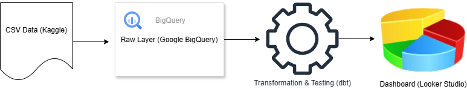

# Fintech Credit Analytics: Scalable Data Pipeline for Loan Risk Monitoring


## Project Overview

Pipeline ini mensimulasikan *end-to-end data transformation* untuk institusi finansial (Fintech/Multi-finance). Raw data riwayat kredit diproses menjadi model analitik yang siap dikonsumsi oleh tim Risk dan Business Intelligence.

**Business Context:**
Tim Risk Analyst memerlukan visibilitas harian terhadap performa portofolio kredit. Pipeline ini mengotomasi seluruh proses transformasi data — dari raw layer hingga mart layer — sehingga tim dapat memantau metrik utama tanpa query manual yang berulang.

---

## Tech Stack

| Layer | Tool | Versi |
|---|---|---|
| Cloud Data Warehouse | Google BigQuery | - |
| Data Transformation | dbt Core + dbt-bigquery | 1.8.2 |
| Orchestration & CI/CD | GitHub Actions | - |
| Visualization | Looker Studio | - |
| Language | SQL, YAML, Python | Python 3.10 |

---

## Data Architecture


*Star schema dengan tiga layer: Staging → Intermediate → Marts*

---

## Data Modeling (Star Schema)

Pipeline mengadopsi pendekatan modular dbt dengan struktur tiga layer:

**Staging Layer (`stg_`)** — Membersihkan data mentah, standarisasi penamaan kolom ke *snake_case*, dan penyesuaian tipe data.

**Intermediate Layer (`int_`)** — JOIN antara profil nasabah (`stg_loans`) dengan riwayat BI Checking (`stg_bureau`), agregasi histori kredit per nasabah, serta kalkulasi **Debt-to-Income Ratio (DTI)** sebagai metrik risiko utama.

**Marts Layer (`dim_`, `fct_`, `obt_`)** — Membangun Dimension dan Fact tables, lalu didenormalisasi menjadi **One Big Table (`obt_credit_risk`)** yang dioptimalkan untuk performa dashboard Looker Studio.

### Skema Kolom Utama: `obt_credit_risk`

| Kolom | Tipe | Deskripsi |
|---|---|---|
| `application_id` | STRING | Primary key unik per pengajuan kredit |
| `client_id` | STRING | Foreign key ke dim_clients |
| `is_default` | INT64 | Label default: 0 = Lancar, 1 = Macet |
| `contract_type` | STRING | Jenis kontrak pinjaman |
| `total_income_idr` | NUMERIC | Total pendapatan nasabah |
| `loan_amount_idr` | NUMERIC | Jumlah pinjaman yang diajukan |
| `loan_annuity_idr` | NUMERIC | Cicilan bulanan pinjaman |
| `debt_to_income_ratio` | FLOAT64 | Rasio cicilan terhadap pendapatan (DTI) |
| `total_previous_loans` | INT64 | Jumlah histori kredit di bank lain |
| `total_bureau_debt_idr` | NUMERIC | Total outstanding hutang di bank lain |
| `gender` | STRING | Jenis kelamin nasabah |
| `owns_car` | STRING | Kepemilikan kendaraan |
| `owns_realty` | STRING | Kepemilikan properti |
| `total_children` | INT64 | Jumlah tanggungan anak |
| `income_type` | STRING | Jenis penghasilan nasabah |
| `education_level` | STRING | Tingkat pendidikan nasabah |
| `family_status` | STRING | Status pernikahan nasabah |
| `housing_type` | STRING | Jenis tempat tinggal nasabah |
| `age_years` | INT64 | Umur nasabah dalam tahun |
| `years_employed` | INT64 | Lama bekerja dalam tahun |

---

## How to Run Locally

### Prerequisites
- Python 3.10+
- Google Cloud SDK
- Service Account dengan akses BigQuery Editor & BigQuery Job User

### 1. Clone & Install Dependencies

```bash
git clone https://github.com/zerogravity070824/fintech-credit-analytics.git
cd fintech-credit-analytics
pip install dbt-bigquery==1.8.2
```

### 2. Install dbt Packages

```bash
dbt deps
```

### 3. Setup `profiles.yml`

File ini **tidak di-commit ke repo** (sudah ada di `.gitignore`). Buat manual di `~/.dbt/profiles.yml`:

```yaml
my_first_project:
  target: dev
  outputs:
    dev:
      type: bigquery
      method: service-account
      project: your-gcp-project-id
      dataset: dbt_staging
      location: asia-southeast2
      keyfile: /path/to/your/service-account-key.json
      threads: 4
      timeout_seconds: 300
```

### 4. Verifikasi Koneksi

```bash
dbt debug
```

Semua check harus `OK` sebelum lanjut.

### 5. Jalankan Pipeline

```bash
# Cek kesegaran data sumber
dbt source freshness

# Jalankan semua model
dbt run

# Validasi kualitas data
dbt test
```

### 6. Jalankan Model Spesifik (Opsional)

```bash
# Hanya layer staging
dbt run --select staging

# Hanya model tertentu beserta dependensinya
dbt run --select +obt_credit_risk
```

---

## CI/CD Pipeline

Pipeline dijalankan via **GitHub Actions** dengan tiga mekanisme trigger:

- **On push ke `main`** — dijalankan otomatis setiap ada perubahan kode
- **Scheduled cron (06:00 WITA)** — batch harian untuk memastikan data selalu fresh
- **Manual `workflow_dispatch`** — untuk kebutuhan on-demand run

**Urutan eksekusi:**

1. Autentikasi ke Google Cloud menggunakan Service Account yang disimpan di GitHub Secrets
2. `dbt deps` — install dbt packages
3. `dbt source freshness` — validasi kesegaran data sumber sebelum transformasi
4. `dbt run` — eksekusi model dan update tabel di BigQuery **(CD)**
5. `dbt test` — validasi kualitas data: tidak ada null pada Primary Key, tidak ada duplikat, dan pengecekan anomali lainnya **(CI)**

Dependency caching Python diaktifkan untuk mempercepat build time.

**GitHub Secrets yang diperlukan:**

| Secret | Keterangan |
|---|---|
| `GCP_SA_KEY` | JSON key dari Service Account GCP |
| `GCP_PROJECT_ID` | Project ID Google Cloud |
| `DBT_DATASET` | Nama dataset target di BigQuery |

---

## Dashboard & Visualization

Data dari `obt_credit_risk` dihubungkan langsung ke Looker Studio untuk monitoring portofolio.

**[→ Lihat Dashboard Looker Studio](https://lookerstudio.google.com/reporting/30bb83de-cf37-4263-a1d2-b05fccebd04b)**

Metrics yang dipantau:
- Default Rate (segmentasi nasabah lancar vs macet)
- Portfolio Distribution by Income Type & Education Level
- Debt-to-Income Ratio Distribution
- Total Applicants & Loan Amount Distribution
- Bureau Debt & Previous Loans Analysis

---

*Ilham — 2026*